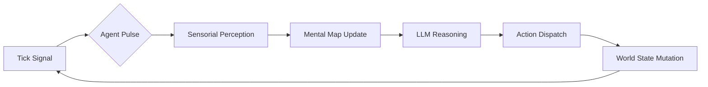

<p align="center">
  
</p>

# 🪐 Caosmos

<p align="center">
  <b>A high-performance simulation engine for living worlds, powered by autonomous AI agents.</b>
</p>

<p align="center">
  <a href="https://github.com/alexpicode/caosmos-ui">🖥️ <b>Visual Interface (Caosmos UI)</b></a> | 
  <a href="docs/ARCHITECTURE.md">🏗️ <b>Technical Architecture</b></a> |
  <a href="ROADMAP.md">🗺️ <b>Project Roadmap</b></a>
</p>

<p align="center">
  <a href="https://openjdk.org/projects/jdk/25/"></a>
  <a href="https://spring.io/projects/spring-boot"></a>
  <a href="https://spring.io/projects/spring-modulith"></a>
  <a href="LICENSE"></a>
  <a href="mailto:alexpicode@proton.me"></a>
</p>

---

## 🎭 The Philosophy: Beyond Traditional RPGs

Caosmos rejects the "static stage" approach of traditional RPGs. In this world:

- **🚫 No "Prop" NPCs**: There are no static characters waiting for a quest trigger. Every citizen is a fully autonomous
  entity with its own biology, needs, and cognitive cycle.
- **🔄 Persistent World State**: Every action leaves a mark. If an agent chops a tree and drops the wood, that wood
  remains in the world. Other citizens can perceive it, pick it up, or use it later, creating an emergent chain of
  events.
- **🎭 Emergent Narratives**: Stories aren't written; they are lived. Narrative in Caosmos is the unplanned result of
  hundreds of autonomous agents pursuing their own goals and interacting with a reactive world.
- **🏗️ Semantic Foundation**: We prioritize meaning over raw data. Everything in the world—from a "rusty sword" to a "
  crowded tavern"—is defined semantically, allowing AI agents to reason about their environment with human-like logic.
- **🌱 Free Will via Non-Determinism**: We embrace the probabilistic nature of LLMs. In Caosmos, "hallucinations" or 
  unexpected decisions are not bugs; they are the citizen's free will, ensuring that no two entities ever behave exactly
  the same way in identical circumstances.

---

## 🏛️ The Olympus of Directors: The Gods of the Simulation

Caosmos is governed by a council of Macro-Agents known as **Directors**. If the Citizens are the mortals living in the
simulation, the Directors are the gods who shape their reality, intervene in their fate, and maintain the balance of the
universe.

- **⚖️ The Judge (Arbitrator)**: The keeper of physical laws. When a mortal attempts the impossible or the unknown, the
  Judge decides if the world yields or breaks, carving new "Natural Laws" into the **Wisdom Cache**.
- **👁️ The Discoverer (Observer)**: The source of all sensorial truth. It breathes life into the void, describing the
  world's objects and secrets to the citizens as they perceive them for the first time.

*More Directors (Ecosystem, Economy, Conflict, and Geography) are envisioned as the simulation evolves into a fully
autonomous society.*

---

## 🚀 Key Features

### 🧠 Autonomous Cognitive Agents

Each citizen has a dedicated **Virtual Thread** (Project Loom) running a cognitive loop powered by Google Gemini (GenAI). They perceive the environment semantically, reason about their goals, and execute actions.

### ⏱️ Tick-Based High-Concurrency Engine

A robust simulation loop that leverages Java 25's lightweight concurrency to simulate hundreds of agents simultaneously
without CPU bottlenecks.

### 👁️ Spatial Semantic Perception

Advanced spatial hashing and zone management translate 3D geometry into semantic data. Agents don't see "X:10, Z:20";
they see "A [Heavy] [Rusty] Iron Sword near the [Blacksmith] forge."

### 🎭 Creative Directors & Wisdom Cache

Complex interactions (e.g., "Use [Magic Wand] on [Frozen Lake]") are arbitrated by AI "Directors." To ensure
performance, results are hashed and stored in the **Wisdom Cache**, making future identical interactions instantaneous.

### 💬 Dynamic Social & Conversation System

Agents engage in multi-participant conversation sessions. A social heuristics engine determines when an agent should
respond, listen, or let a conversation naturally end based on contextual relevance.

### 📝 Hot-Reloadable Manifests

Agents and world profiles are defined via hybrid Markdown files (YAML frontmatter + Markdown body). You can tweak an
agent's personality or stats on the fly, and the simulation will hot-reload them without requiring a restart.

### 🗺️ Task & Exploration System

Citizens can undertake long-duration tasks—like traveling across zones, working, or resting. They maintain an internal
mental map of the world and track their exploration progress across different environments.

### 🏡 Organic Property & Ownership

The engine enforces logical boundaries and object ownership. Agents can claim interior zones or items, and the spatial
perception system ensures these boundaries dictate who can see, interact with, or modify objects.

---

## 🛠️ How it Works: The Cognitive Loop

Each agent follows a continuous cycle of perception and action, decoupled from the main simulation tick for maximum
efficiency.



---

## 📁 Project Architecture

Caosmos is built as a **Modular Monolith** using **Clean Architecture** and **Spring Modulith**.

| Module      | Responsibility                                                  |
|:------------|:----------------------------------------------------------------|
| `common`    | Shared Kernel, Virtual Thread management, and the Master Clock. |
| `citizens`  | Biology, Task management, and Cognitive Cycles.                 |
| `world`     | Spatial Hash, Zones, and Perception Providers.                  |
| `actions`   | Strategy-based handlers for every possible world interaction.   |
| `directors` | Creative arbitration and descriptive observation logic.         |

---

## 📚 Documentation & Deep Dives

To understand the core mechanics of the Caosmos engine, explore our detailed functional documentation:

* [**Will Cycle** (Actions & Tasks)](docs/features/ACTIONS_AND_TASKS.md): How intentions become physical actions and
  persistent states.
* [**The Sensory Horizon** (Perception)](docs/features/PERCEPTION_AND_KNOWLEDGE.md): How agents perceive, filter, and
  remember their surroundings.
* [**Context Geography** (Hierarchy)](docs/features/WORLD_HIERARCHY.md): Nested zones, gateways, and spatial semantics.
* [**Wisdom Cache** (Physics)](docs/features/WISDOM_CACHE.md): Hashed AI arbitration and emergent natural laws.
* [**The Olympus of Directors**](docs/features/DIRECTORS.md): High-level orchestrators of creative emergence.
* [**Tag System**](docs/features/TAG_SYSTEM.md): The semantic foundation driving world logic.

---

## 🚦 Quick Start

### Prerequisites

- **JDK 25** (Mandatory for Virtual Threads if running locally).
- **Docker & Docker Compose** (Recommended for easy deployment).
- **Google GenAI API Key** (Required for AI cognitive cycles).

### 🚀 Fast Track (Docker)

The simplest way to launch the universe:

1. **Setup Env**: `cp .env.example .env` (and add your `GOOGLE_AI_API_KEY`).
2. **Launch**: `docker-compose up -d`
3. **Explore**: Open [http://localhost:8080/swagger-ui.html](http://localhost:8080/swagger-ui.html)

---

## 🐳 Docker Deployment

Caosmos provides a production-ready Docker configuration for consistent environments.

### 1. Configuration
Manage your setup via the `.env` file:
- `GOOGLE_AI_API_KEY`: Your Gemini API key.
- `HOST_PORT`: Port exposed on your machine (default: `8080`).
- `SPRING_PROFILES_ACTIVE`: Set to `docker` (handled automatically by Compose).

### 2. Commands
- **Start**: `docker-compose up -d`
- **Stop**: `docker-compose down`
- **Rebuild**: `docker-compose up -d --build`
- **Logs**: `docker-compose logs -f`

### 3. Volumes & Persistence
The engine uses a bind mount for the configuration directory:
- `./config:/app/config`: Contains all world and citizen manifests.
Changes made to files in `./config` on your host machine are immediately reflected inside the container.

---

## 🛠️ Local Development (Manual)

If you prefer to run the engine directly on your host machine:

### Installation

1. **Clone & Enter**:
   ```bash
   git clone https://github.com/alexpicode/caosmos.git
   cd caosmos
   ```

2. **Setup AI Backend**:
    - **Cloud AI**: `export GOOGLE_AI_API_KEY=your_key`

3. **Launch the Universe**:
   ```bash
   ./mvnw spring-boot:run
   ```

### 🛰️ Interactive API

Explore the live simulation state and trigger actions manually via the Swagger UI:
👉 [http://localhost:8080/swagger-ui.html](http://localhost:8080/swagger-ui.html)

---

## ⚙️ Configuration

Override these in `application.yml` or via Environment Variables:

- `GOOGLE_AI_MODEL`: Set your preferred Gemini model (e.g., `gemini-1.5-flash`).
- `citizen.pulse-frequency`: Adjust how many ticks pass between agent "thoughts".
- `world.time.time-scale`: Control the speed of simulated time.

---

## 🤝 Contributing

We welcome explorers and architects! To get started, please read our [**Contributing Guide**](CONTRIBUTING.md).

1. Check the [ARCHITECTURE.md](docs/ARCHITECTURE.md) for deep-dives.
2. Open an issue or submit a PR for new `ActionHandlers` or `Directors`.

---

## 📬 Contact

If you have any questions, suggestions, or would like to collaborate, feel free to reach out:

📧 **Email**: [alexpicode@proton.me](mailto:alexpicode@proton.me)

---

<p align="center">
  <i>Built with ❤️ for the future of emergent AI simulations.</i>
</p>
