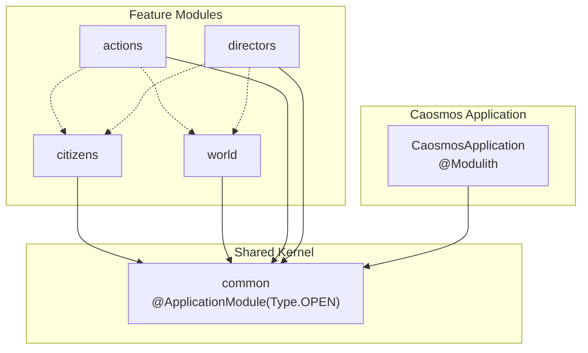
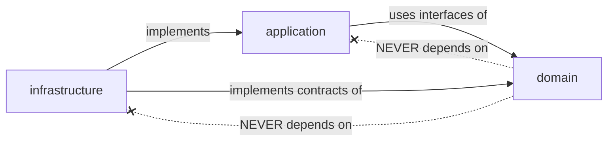
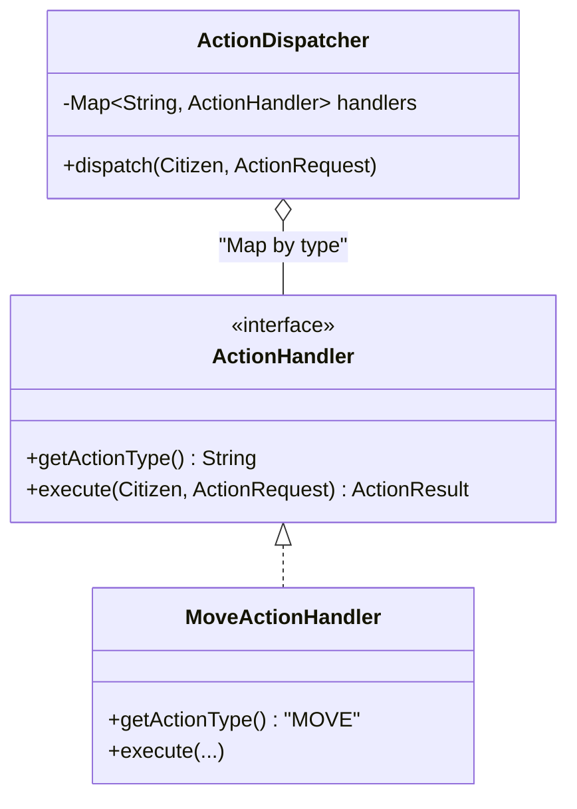
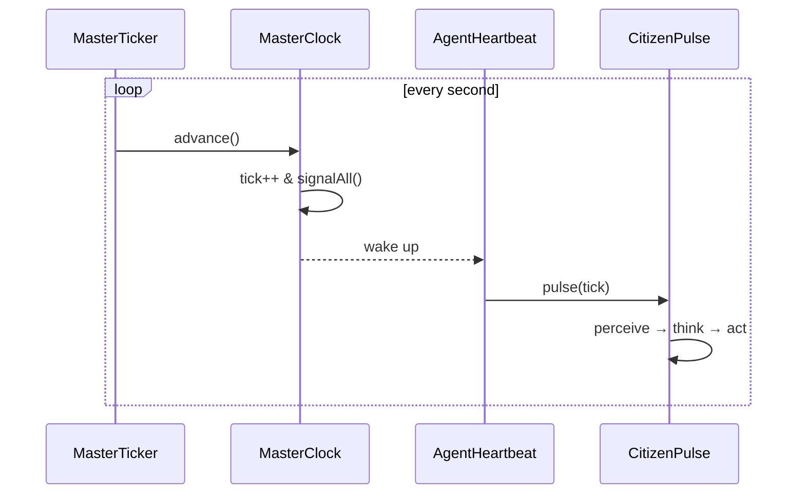
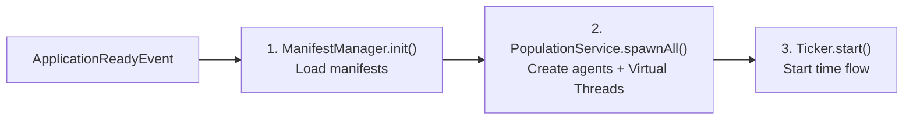

# Caosmos Architecture

> Living world simulation engine with AI-driven autonomous agents.

---

## 1. Architecture Type

Caosmos combines two complementary architectural styles:

| Style                                 | Application in Caosmos                                                                                                                                                                              |
|:---------------------------------------|:---------------------------------------------------------------------------------------------------------------------------------------------------------------------------------------------------|
| **Clean Architecture**                 | Each module is organized in three layers: `domain`, `application`, `infrastructure`. Dependencies always point inward (infrastructure → application → domain).                            |
| **Vertical Slicing (Spring Modulith)** | Each business feature (`citizens`, `world`, `actions`, `directors`) is an autonomous module with its own three layers. Modules communicate through the **Shared Kernel** (`common`). |

```
@Modulith(sharedModules = "common")
```

### Module Diagram



---

## 2. Layer Structure and Responsibilities

Each module replicates the same internal three-layer structure:

```
module/
├── application/       ← Orchestration, use cases, application services
├── domain/            ← Entities, value objects, contracts (interfaces/ports)
│   ├── model/         ← Records, pure entities
│   ├── contracts/     ← Interfaces / Ports
│   └── service/       ← Domain services (pure logic without external dependencies)
└── infrastructure/    ← Adapters, concrete implementations, configuration
```

### Responsibility by Layer

| Layer               | Responsibility                                                                                      | Example                                                                                         |
|:-------------------|:-----------------------------------------------------------------------------------------------------|:------------------------------------------------------------------------------------------------|
| **Domain**         | Pure models, business rules, contracts (ports). **No framework dependencies.**              | `Citizen`, `MasterClock`, `AgentPulse`, `WorldObject`, `Vector3`                                |
| **Application**    | Use case orchestration. Coordinates domain and infrastructure via dependency injection. | `CitizenPulse`, `CitizenPopulationService`, `ActionDispatcher`, `SimulationStartupOrchestrator` |
| **Infrastructure** | Concrete implementations of domain ports. Adapters to frameworks and external services.    | `SpringAiThinkingAdapter`, `SpatialWorldPerceptionProvider`, `MasterTicker`, `AgentLifeManager` |

### Dependency Constraints

> [!CAUTION]
> **Strict dependency rule**: Inner layers NEVER depend on outer layers.



- `domain` does **not** import anything from `application` or `infrastructure`.
- `application` depends on `domain` (contracts/models), but **not** on `infrastructure`.
- `infrastructure` implements the contracts defined in `domain` and the services of `application`.

---

## 3. Module `common` — Shared Kernel

The `common` module is the **shared kernel** between all modules. It is marked as `ApplicationModule.Type.OPEN`,
which allows any module to access it without Modulith restrictions.

### Shared Kernel Content

| Package                | Focus Area                                                                                    | Purpose                                                                                                                                                         |
|:-----------------------|:----------------------------------------------------------------------------------------------|:------------------------------------------------------------------------------------------------------------------------------------------------------------------|
| `domain.contracts`     | Core capabilities (AI, perception, entities, world ops)                                       | **Ports**: interfaces that define the capabilities the domain needs without knowing the implementation.                                                           |
| `domain.model`         | Geometric data, action payloads, manifests, perception states                                 | **Value Objects** shared between modules. Immutable (`record`).                                                                                               |
| `domain.service.core`  | Simulation timekeeping                                                                        | Central simulation clock with synchronization via `ReentrantLock`/`Condition`.                                                                                |
| `application.*`        | Use cases for startup, agent lifecycle, manifests, AI templates, and telemetry                | Application services and contracts for orchestration and cross-cutting concerns.                                                                                  |
| `infrastructure`       | Adapters for Spring AI, threading, file system, JSON conversion, and in-memory repositories   | Concrete implementations of domain and application ports.                                                                                                  |

---

## 4. Identified Design Patterns

### 4.1. Ports & Adapters (Hexagonal)

The domain defines **ports** (interfaces) and infrastructure provides concrete **adapters**.

| Concept Category                | Domain Need (Port)                     | Infrastructure Solution (Adapter)                    | Modules               |
|:--------------------------------|:---------------------------------------|:-----------------------------------------------------|:----------------------|
| **AI Integration**              | Interfaces for reasoning & arbitration | LLM Implementations (e.g., Spring AI, GenAI)         | common, directors     |
| **World Perception**            | Contracts for spatial awareness        | Concrete geometry, spatial hashing, and collision    | world                 |
| **Simulation Lifecycle**        | Heartbeat and tick management          | Virtual threads and concurrent lock managers         | common                |
| **Entity Management**           | Agent instantiation and lifecycle      | Database or in-memory persistence logic              | citizens              |
| **Action Orchestration**        | Request routing and dispatch           | Strategy executors mapped to actions                 | actions               |
| **Configuration & Prompts**     | Manifest and prompt templates          | File system watchers and static resource loaders     | common                |

#### Adaptation Patterns in Actions

The `actions` module implements the adapter pattern in two ways:

1. **Domain Adapter**: `ActionHandler` is a domain port that defines how actions should be executed
2. **Concrete Adapters**: Each handler adapts agent intentions to concrete world operations

Handlers use external ports (`WorldPort`, `CitizenPort`, `EconomyPort`) to maintain separation of concerns.

**Categories of Handlers:**
- **Movement**: Moving to coordinates or traveling to specific zones.
- **Consumption & Rest**: Eating, drinking, sleeping, and resting.
- **Inventory & Equipment**: Picking up, dropping, equipping, and unequipping items.
- **Interaction**: Using, interacting with, or examining objects.
- **Creation & Work**: Crafting new items or working at designated locations.
- **Social**: Communicating with other citizens.
- **Exploration & Property**: Exploring zones and claiming properties.
- **Continuity**: Waiting or continuing ongoing tasks.

### 4.2. Strategy Pattern

The action system uses the Strategy pattern for extensible action resolution:



New actions are implemented as new `ActionHandler` in the `application.handlers` package without modifying `ActionDispatcher`.

#### Automatic Handler Registration

Spring Boot automatically injects all beans implementing `ActionHandler` into `ActionDispatcher`:

```java
public ActionDispatcher(List<ActionHandler> handlerList) {
  this.handlers = handlerList.stream()
      .collect(Collectors.toMap(ActionHandler::getActionType, h -> h));
}
```

This allows adding new actions simply by creating a new `@Component` class that implements `ActionHandler`.

### 4.3. Tick-Based Game Loop

The server operates with a tick-based simulation loop:

```
MasterTicker (Virtual Thread)
    └── runLoop()
         ├── clock.advance()        ← Increments tick atomically
         ├── signalAll()            ← Wakes up all AgentHeartbeat
         └── sleep(TICK_DURATION)   ← Maintains 1 tick/second cadence
```

Each agent has its own `AgentHeartbeat` (Virtual Thread) that:

1. Waits N ticks (`clock.waitForTicks(frequency)`)
2. Executes `mind.pulse(tick)` — the agent's cognitive cycle

**Configuration:**
- `citizen.pulse-frequency`: 5 ticks (configurable in `application.yml`)
- `world.time.time-scale`: 60.0 (1 real second = 60 simulated seconds)

### 4.4. Template Method (Cognitive Cycle)

The `AgentPulse.pulse(tick)` contract defines the cognitive cycle skeleton. Each agent type implements its own version:

```
CitizenPulse.pulse(tick):
  1. PhysiologicalMotor.decayVitality()           ← Update biological state
  2. CitizenPerceptionHandler.getPerception()     ← Get world perception
  3. PerceptionMonitor.evaluate()                ← Evaluate critical stimuli (reflexes)
  4. CitizenTaskManager.executeActiveTask()      ← Execute active task if exists
  5. CitizenDecisionMaker.makeDecision()         ← Make decision via AI
  6. ActionDispatcher.dispatch()                 ← Execute the decided action
```

### 4.5. Observer / Pub-Sub (Clock Coordination)

The `MasterClock` acts as a temporal event publisher. `AgentHeartbeat` instances subscribe by blocking on `waitForTicks()` and react when the clock advances. This decouples time control from agent execution.

**Temporal Events:**
- `ConversationManager.tickUpdate()` - Advances conversation sessions
- `TemporalElementManager` - Management of temporal elements (SpeechElement)

### 4.6. Manifest / Data-Driven Design

Agents are configured externally via hybrid `.md` files (YAML frontmatter + Markdown body), allowing **hot-reload** without recompilation:

```yaml
# Frontmatter → CitizenProfile (Java Record)
name: "Alice"
baseLocation: { x: 0, y: 0, z: 0 }
status: { vitality: 100, hunger: 30, energy: 80 }
---
# Body → Personality (injected as SystemPrompt)
You are Alice, a diligent worker...
```

**Enhanced Manifest System:**
- `ManifestFileSystemResolver` - External file resolution
- `ManifestInMemoryRepository` - In-memory repository
- `ManifestWatcher` - Change monitoring for hot-reload
- `ManifestParser` - Parsing of YAML frontmatter + Markdown body
- Support for director manifests (e.g., `climate_director.md`)

---

### 4.7. Task Pattern (Task System)

The `citizens` module implements a task system to manage long-duration activities:

**Task Categories:**
- **Navigation**: Exploring zones or traveling to specific destinations.
- **Recovery**: Resting or sleeping to replenish energy.
- **Productivity**: Performing work duties at employment locations.
- **Social**: Participating in multi-agent conversations.
- **Passive**: Waiting or holding current state.

**Components:**
- `Task` - Base task interface
- `TaskRegistry` - Registry of active tasks by citizen
- `CitizenTaskManager` - Task execution manager
- `ActiveTask` - Active task state in perception

**Execution Flow:**
1. LLM assigns task → `CitizenPort.assignXxxTask()`
2. `TaskRegistry` registers the task
3. `CitizenTaskManager.executeActiveTask()` executes the task each tick
4. Task complete → `cancelActiveTask()` and cleanup

### 4.8. Social Pattern (Conversation System)

Multi-participant conversation system with session management:

**Components:**
- `ConversationManager` - Conversation session manager
- `ConversationSession` - Session with participants, history, and phases
- `ConversationPhase` - Phases: INITIATED, ACTIVE, STALE, ENDED
- `DialogueLine` - Dialogue line with metadata
- `SocialHeuristicsEngine` - Social heuristics engine
- `SpeechHeuristic` - Individual response heuristic

**Conversation Phases:**
1. **INITIATED** - Session created, awaiting response
2. **ACTIVE** - Conversation in progress
3. **STALE** - 30 ticks without activity
4. **ENDED** - 60 ticks without activity, automatic cleanup

**Perception Integration:**
- `SpeechElement` in the world with configurable TTL
- `PerceptionMonitor` detects social messages
- `SocialHeuristicsEngine` decides whether to respond

### 4.9. Director Pattern (Creative Arbitration)

The `directors` module implements complex action arbitration via AI:

**Components:**
- `DirectorArbitrator` - USE interaction orchestrator
- `ArbitrationProvider` - Port for AI arbitration
- `ObservationProvider` - Port for descriptive observation
- `EffectResolver` - State mutation resolver
- `WisdomCacheService` - Cache of previous decisions
- `CacheKeyGenerator` - Deterministic hash key generator

**Arbitration Flow:**
1. User executes `USE` on object
2. `DirectorArbitrator` collects context (tool tags, target, environment)
3. Generates `CacheKey` based on action semantics
4. **Fast Path**: Queries wisdom cache
5. **Creative Path**: If miss, delegates to AI (`ArbitrationProvider`)
6. AI returns `ResolutionResult` with mutations and narration
7. `EffectResolver` applies mutations to world state
8. Result is cached for future queries

**Mutation Types:**
- `ADD_TAG`, `REMOVE_TAG` - Tag modification
- `DESTROY` - Destruction with matter conservation fallback
- `TRANSFORM` - Entity transformation
- `SPAWN` - Generation of new objects (Tier 1: registry, Tier 2: generated)
- `MODIFY_CITIZEN` - Citizen statistics modification
- `SET_DESCRIPTION` - Description update

**Spawnable Registry:**
- Canonical registry of spawnable objects in `spawnable-registry.yml`
- Destruction fallbacks for matter conservation
- Support for dynamic generation (Tier 2)

---

## 5. Main Systems

### 5.1. Temporal Simulation System

**Purpose**: Control the flow of time in the world.

| Component Role  | Responsibility                                                                              |
|:----------------|:--------------------------------------------------------------------------------------------|
| **Timekeeper**  | Source of truth for current tick. Synchronizes threads via `ReentrantLock` + `Condition`.   |
| **Main Loop**   | Advances the clock at a fixed cadence (1s per tick). Detects overloads.                     |
| **Agent Thread**| Virtual thread per agent that listens to the clock and executes the cognitive pulse.        |



### 5.2. Cognitive Agent System

**Purpose**: Provide each inhabitant with a perception-reasoning-action cycle.

| Subsystem             | Layer        | Responsibility                                                                                              |
|:----------------------|:-------------|:------------------------------------------------------------------------------------------------------------|
| **Entity Models**     | Domain       | Pure entities with biological states, inventory, and profiles.                                              |
| **Cognitive Engine**  | Application  | Orchestrates the cycle: perception → prompt evaluation → LLM reasoning → decision.                          |
| **Population Logic**  | Application  | Handles spawning from manifests and connects entities to their lifecycle threads.                           |
| **Physiology Motor**  | Application  | Updates vitality, hunger, energy, and stress over time.                                                     |
| **Task Management**   | Application  | Manages ongoing tasks and tick-by-tick execution of long-duration activities.                               |
| **Social Manager**    | Application  | Handles multi-participant conversation sessions and responses.                                              |
| **Adapters**          | Infra        | Concrete persistence logic and AI connections (with per-agent memory contexts).                             |

### 5.3. World Perception System

**Purpose**: Translate the geometric state of the world into LLM-consumable semantic information.

| Subsystem                | Layer          | Responsibility                                                                                                            |
|:-------------------------|:---------------|:--------------------------------------------------------------------------------------------------------------------------|
| **Spatial Indexing**     | Domain Service | Grid and coordinate hashing for O(1) nearby entity search and collision detection.                                        |
| **Environment Logic**    | Domain Service | Provides dynamic environmental conditions (weather, temperature, zone semantics) and translates server ticks to time.     |
| **Perception Engine**    | Domain Service | Calculates visual coverage, resolves occlusions, and groups nearby entities with relative vectors and semantic tags.      |
| **Context Aggregation**  | Application    | Filters pure spatial data with agent memory (mental map) and evaluates critical stimuli (reflexes).                       |
| **World Initialization** | Application    | Loads initial world data (zones, static objects, resources) from configuration sources.                                   |
| **Provider Adapter**     | Infrastructure | Composes all domain services into a concrete `WorldPerception` payload to satisfy domain ports.                           |

### 5.4. Action System

**Purpose**: Resolve agent intentions into world consequences.

| Subsystem             | Layer              | Responsibility                                                                           |
|:----------------------|:-------------------|:-----------------------------------------------------------------------------------------|
| **Central Router**    | Application        | Central dispatcher that maps an incoming request type to the appropriate strategy.       |
| **Strategies**        | Domain (contracts) | Specialized logic (Handlers) for resolving specific types of requests (e.g., Movement).  |
| **Data Models**       | Domain (models)    | Immutable DTOs representing inputs (Intents/Requests) and outputs (Mutations/Results).   |

#### Actions Module Structure

```
actions/
├── domain/
│   ├── ActionHandler.java           ← Domain interface for action handlers
│   └── ActionThresholds.java        ← Configuration thresholds for actions
└── application/
    ├── ActionDispatcher.java        ← Central router with handler injection
    └── handlers/                    ← Directory containing all specific ActionHandler implementations
```

#### Action Execution Flow

1. **CitizenPulse** generates an `ActionRequest` with type and parameters
2. **ActionDispatcher** receives the request and finds the appropriate handler
3. Specific **ActionHandler** executes the concrete logic:
    - Validates parameters
    - Interacts with domain ports (`WorldPort`, `CitizenPort`, `EconomyPort`)
    - Modifies agent and/or world state
    - Returns `ActionResult` with success/failure

#### Integration with Directors

The `UseActionHandler` delegates to the `directors` module for complex interactions:
- `DirectorArbitrator.resolveInteraction()` arbitrates the action via AI
- `EffectResolver` applies the resulting state mutations
- The result includes AI-generated descriptive narration

### 5.5. Directors System (Creative Arbitration)

**Purpose**: Manage complex interactions via AI with wisdom cache to avoid repeated queries.

| Subsystem                | Layer          | Responsibility                                                                                                            |
|:-------------------------|:---------------|:--------------------------------------------------------------------------------------------------------------------------|
| **Arbitration Engine**   | Application    | Orchestrates complex creative interactions (like "USE") by coordinating caching, AI querying, and effect resolution.      |
| **Wisdom Cache**         | Application    | Prevents repeated queries by hashing interaction semantics and caching the deterministic outcomes.                        |
| **Effect Application**   | Application    | Parses AI-generated mutations (Spawn, Destroy, Transform, Modify Stats) and applies them to the world state.              |
| **AI Providers**         | Infra / Ports  | Contracts and Spring AI adapters for obtaining creative resolutions and descriptive narrations from LLMs.                 |
| **Cache Repositories**   | Infra / Ports  | Repositories supporting the fast-path resolution by storing previous creative decisions.                                  |

**Complete Arbitration Flow:**
1. Citizen executes `USE` on object
2. `UseActionHandler` delegates to `DirectorArbitrator`
3. Collects context: tool tags, target, environment
4. Generates `CacheKey` with SHA-256 of ordered semantics
5. Queries `WisdomCacheService` → If HIT, returns cached result
6. If MISS: delegates to `ArbitrationProvider` (AI)
7. AI generates `ResolutionResult` with mutations and narration
8. `EffectResolver` applies mutations (SPAWN, DESTROY, TRANSFORM, etc.)
9. Result is cached if `shouldCache()` is true
10. Returns `ActionResult` with narration to citizen

**Matter Conservation:**
- Fallback system in `spawnable-registry.yml`
- Object with `burnable` tag → spawns `ASH` when destroyed
- Object with `breakable` tag → spawns `STONE_DEBRIS` when destroyed

### 5.6. Manifest and Configuration System

**Purpose**: Define agents and directors via external files with hot-reload.

| Subsystem                 | Layer           | Role                                                                                                               |
|:--------------------------|:----------------|:-------------------------------------------------------------------------------------------------------------------|
| **Manifest Orchestration**| Application     | Initialization, loading, and central monitoring of world and agent manifests.                                      |
| **Parsing & Resolution**  | Infrastructure  | Logic to parse YAML frontmatter + Markdown bodies and resolve file paths internally/externally.                    |
| **Live Reloading**        | Infrastructure  | File watchers that detect modifications and trigger live updates to active entities without restarting the server. |
| **Data Repositories**     | Infrastructure  | In-memory storage of loaded manifests for fast retrieval.                                                          |
| **Data Models**           | Domain / Config | Definitions of agent profiles, prompt templates, and system personalities.                                         |

**Available Prompts:**
- `citizen-system.md` - System prompt for citizens (12KB)
- `citizen-user.md` - User prompt template for citizens
- `director-arbitration-system.md` - System prompt for arbitration
- `director-observer-system.md` - System prompt for observations

### 5.7. Startup System

**Purpose**: Orchestrate the initialization sequence of the simulated universe.



Controlled by `SimulationStartupOrchestrator` listening to Spring's `ApplicationReadyEvent`.

---

## 6. Technology Stack

| Technology               | Version  | Usage                                                                      |
|:-------------------------|:---------|:-------------------------------------------------------------------------|
| **Java**                 | 25       | Base language with Virtual Threads support (Project Loom) and Records     |
| **Spring Boot**          | 4.0.3    | Core framework, dependency injection, lifecycle                 |
| **Spring Modulith**      | 2.0.3    | Module boundary enforcement, shared kernel                    |
| **Spring AI**            | 2.0.0-M2 | LLM integration (Google GenAI) for agent reasoning          |
| **Springdoc OpenAPI**   | 3.0.2    | REST API documentation (Swagger UI)                                   |
| **Jackson YAML**         | —        | YAML frontmatter parsing in manifests                                |
| **Jackson JSON**         | —        | JSON serialization/deserialization                                       |
| **Lombok**               | —        | Boilerplate reduction (`@Data`, `@RequiredArgsConstructor`, `@Slf4j`) |
| **Commons Collections4** | 4.5.0    | Additional collection utilities                                  |
| **Virtual Threads**     | (Loom)   | One virtual thread per agent; ticker in own virtual thread                |

**AI Providers:**
- **Google GenAI** (currently configured) - Model configurable via `GOOGLE_AI_MODEL`
- **Ollama** (available, commented) - Model `frob/qwen3.5-instruct` or `qwen3.5`

**AI Configuration:**
- `temperature`: 0.4 (low temperature for more deterministic responses)
- `top-p`: 0.9 (nucleus sampling)
- `max-output-tokens`: 1500
- `response-mime-type`: `application/json` (structured responses)

---

## 7. Concurrency

The concurrency model is designed to scale to hundreds of agents without blocking the CPU:

| Virtual Thread           | Responsibility                                        |
|:-----------------------|:-------------------------------------------------------|
| `master-ticker-loop`   | Main loop: advances `MasterClock` every second     |
| `agent-heartbeat-{id}` | One thread per agent: waits N ticks and executes `pulse()` |

Synchronization is achieved via:

- `AtomicLong` for tick counter (lock-free reads)
- `ReentrantLock` + `Condition` for `signalAll()` to heartbeats
- `ConcurrentHashMap` for active heartbeat registry
- `ConcurrentHashMap` for conversation sessions (`ConversationManager`)
- `ConcurrentHashMap` for task registries (`TaskRegistry`, `CitizenRegistry`)

> [!NOTE]
> Agents **do not** share mutable state with each other. Each `Citizen` is an independent entity accessed
> exclusively by its own `AgentHeartbeat`.

**Temporal Element Management:**
- `SpeechElement` has configurable TTL (`world.speech-ttl-ticks`)
- `TemporalElementManager` manages automatic cleanup of expired elements
- `ConversationManager` automatically cleans up inactive sessions

**Concurrency Configuration:**
- `citizen.pulse-frequency`: 5 (each agent pulses every 5 ticks)
- `citizen.max-conversation-participants`: 4 (maximum per session)
- `world.speech-ttl-ticks`: 2 (speech message lifetime)
