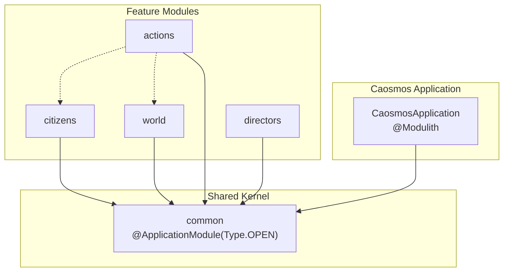
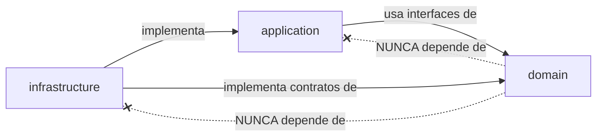
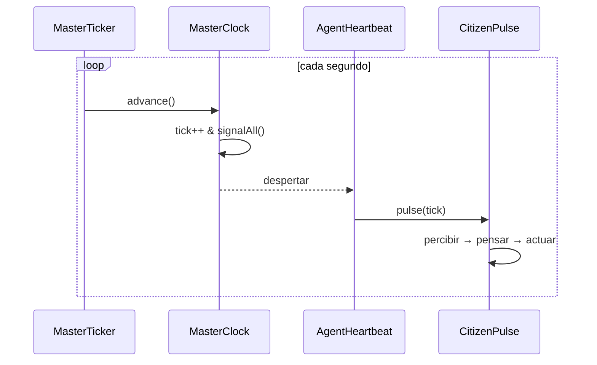
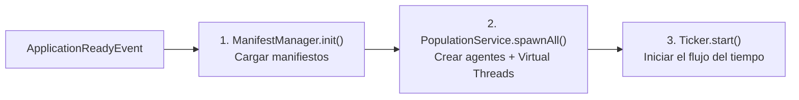

# Arquitectura de Caosmos

> Motor de simulación de mundo vivo con agentes autónomos impulsados por IA.

---

## 1. Tipo de Arquitectura

Caosmos combina dos estilos arquitectónicos complementarios:

| Estilo                                 | Aplicación en Caosmos                                                                                                                                                                              |
|:---------------------------------------|:---------------------------------------------------------------------------------------------------------------------------------------------------------------------------------------------------|
| **Clean Architecture**                 | Cada módulo se organiza en tres capas: `domain`, `application`, `infrastructure`. La dependencia siempre apunta hacia adentro (infraestructura → aplicación → dominio).                            |
| **Vertical Slicing (Spring Modulith)** | Cada funcionalidad del negocio (`citizens`, `world`, `actions`, `directors`) es un módulo autónomo con sus propias tres capas. Los módulos se comunican a través del **Shared Kernel** (`common`). |

```
@Modulith(sharedModules = "common")
```

### Diagrama de Módulos



---

## 2. Estructura de Capas y Responsabilidades

Cada módulo replica la misma estructura interna de tres capas:

```
módulo/
├── application/       ← Orquestación, casos de uso, servicios de aplicación
├── domain/            ← Entidades, value objects, contratos (interfaces/ports)
│   ├── model/         ← Records, entidades puras
│   ├── contracts/     ← Interfaces / Ports
│   └── service/       ← Servicios de dominio (lógica pura sin dependencias externas)
└── infrastructure/    ← Adaptadores, implementaciones concretas, configuración
```

### Responsabilidad por Capa

| Capa               | Responsabilidad                                                                                      | Ejemplo                                                                                         |
|:-------------------|:-----------------------------------------------------------------------------------------------------|:------------------------------------------------------------------------------------------------|
| **Domain**         | Modelos puros, reglas de negocio, contratos (ports). **Sin dependencias de framework.**              | `Citizen`, `MasterClock`, `AgentPulse`, `WorldObject`, `Vector3`                                |
| **Application**    | Orquestación de casos de uso. Coordina dominio e infraestructura mediante inyección de dependencias. | `CitizenPulse`, `CitizenPopulationService`, `ActionDispatcher`, `SimulationStartupOrchestrator` |
| **Infrastructure** | Implementaciones concretas de puertos del dominio. Adaptadores a frameworks y servicios externos.    | `SpringAiThinkingAdapter`, `SpatialWorldPerceptionProvider`, `MasterTicker`, `AgentLifeManager` |

### Restricciones de Dependencia

> [!CAUTION]
> **Regla de dependencia estricta**: Las capas internas NUNCA dependen de las externas.



- `domain` **no** importa nada de `application` ni de `infrastructure`.
- `application` depende de `domain` (contratos/modelos), pero **no** de `infrastructure`.
- `infrastructure` implementa los contratos definidos en `domain` y los servicios de `application`.

---

## 3. Módulo `common` — Shared Kernel

El módulo `common` es el **kernel compartido** entre todos los módulos. Está marcado como `ApplicationModule.Type.OPEN`,
lo que permite que cualquier módulo acceda a él sin restricciones de Modulith.

### Contenido del Shared Kernel

| Paquete                | Contenido                                                                                                                    | Propósito                                                                                                |
|:-----------------------|:-----------------------------------------------------------------------------------------------------------------------------|:---------------------------------------------------------------------------------------------------------|
| `domain.contracts`     | `AgentPulse`, `ThinkingProvider`, `WorldPerceptionProvider`, `JsonSerializer`, `MessageGenerator`                            | **Ports**: interfaces que definen las capacidades que el dominio necesita sin conocer la implementación. |
| `domain.model`         | `Vector3`, `AgentAction`, `ActionRequest`, `ActionResult`, `AgentManifest`, `WorldPerception`, `NearbyEntity`, `Environment` | **Value Objects** compartidos entre módulos. Inmutables (`record`).                                      |
| `domain.service.core`  | `MasterClock`                                                                                                                | Reloj central de simulación con sincronización mediante `ReentrantLock`/`Condition`.                     |
| `application.startup`  | `SimulationStartupOrchestrator`, `Ticker`                                                                                    | Secuencia de arranque: cargar manifiestos → spawn de agentes → iniciar ticker.                           |
| `application.agents`   | `LifeManager`, `PopulationService`                                                                                           | Contratos para gestión del ciclo de vida de los agentes.                                                 |
| `application.manifest` | `ManifestManager`                                                                                                            | Contrato para carga y hot-reload de manifiestos.                                                         |
| `infrastructure`       | `MasterTicker`, `AgentLifeManager`, `AgentHeartbeat`, `SpringAiThinkingAdapter`, `JsonConverterService`                      | Implementaciones concretas de los ports del dominio y aplicación.                                        |

---

## 4. Patrones de Diseño Identificados

### 4.1. Ports & Adapters (Hexagonal)

El dominio define **puertos** (interfaces) y la infraestructura proporciona **adaptadores** concretos.

| Port (Interfaz)           | Adapter (Implementación)                  | Módulo   |
|:--------------------------|:------------------------------------------|:---------|
| `ThinkingProvider`        | `SpringAiThinkingAdapter`                 | common   |
| `WorldPerceptionProvider` | `SpatialWorldPerceptionProvider`          | world    |
| `Ticker`                  | `MasterTicker`                            | common   |
| `LifeManager`             | `AgentLifeManager`                        | common   |
| `PopulationService`       | `CitizenPopulationService`                | citizens |
| `ManifestManager`         | Implementación en infrastructure/manifest | common   |
| `ActionHandler`           | `MoveActionHandler` (y futuros handlers)  | actions  |

#### Patrones de Adaptación en Actions

El módulo `actions` implementa el patrón adaptador de dos maneras:

1. **Adapter de Dominio**: `ActionHandler` es un port del dominio que define cómo deben ejecutarse las acciones
2. **Adaptadores Concretos**: Cada handler (`MoveActionHandler`) adapta las intenciones de los agentes a operaciones
   concretas del mundo

Los handlers utilizan puertos externos (`WorldPort`, `CitizenPort`) para mantener la separación de responsabilidades.

### 4.2. Strategy Pattern

El sistema de acciones usa el patrón Strategy para resolver acciones de forma extensible:


Nuevas acciones (`EAT`, `PICKUP`, `EQUIP`, etc.) se implementan como nuevos `ActionHandler` en el paquete
`application.handlers` sin modificar el `ActionDispatcher`.

#### Registro Automático de Handlers

Spring Boot inyecta automáticamente todos los beans que implementan `ActionHandler` en el `ActionDispatcher`:

```java
public ActionDispatcher(List<ActionHandler> handlerList) {
  this.handlers = handlerList.stream()
      .collect(Collectors.toMap(ActionHandler::getActionType, h -> h));
}
```

Esto permite agregar nuevas acciones simplemente creando una nueva clase `@Component` que implemente `ActionHandler`.

### 4.3. Tick-Based Game Loop

El servidor opera con un bucle de simulación basado en ticks:

```
MasterTicker (Virtual Thread)
    └── runLoop()
         ├── clock.advance()        ← Incrementa tick atómicamente
         ├── signalAll()            ← Despierta todos los AgentHeartbeat
         └── sleep(TICK_DURATION)   ← Mantiene cadencia de 1 tick/segundo
```

Cada agente tiene su propio `AgentHeartbeat` (Virtual Thread) que:

1. Espera N ticks (`clock.waitForTicks(frequency)`)
2. Ejecuta `mind.pulse(tick)` — el ciclo cognitivo del agente

### 4.4. Template Method (Ciclo Cognitivo)

El contrato `AgentPulse.pulse(tick)` define el esqueleto del ciclo cognitivo. Cada tipo de agente implementa su propia
versión:

```
CitizenPulse.pulse(tick):
  1. decayVitality()              ← Actualizar estado biológico
  2. getPerceptionAt(position)    ← Obtener percepción del mundo
  3. buildSystemPrompt()          ← Construir prompt con personalidad
  4. think(agentId, prompt, msg)  ← Delegar razonamiento al LLM
  5. dispatch(action)             ← Ejecutar la acción decidida
```

### 4.5. Observer / Pub-Sub (Coordinación por Reloj)

El `MasterClock` actúa como publicador de eventos temporales. Los `AgentHeartbeat` se suscriben bloqueándose en
`waitForTicks()` y reaccionan cuando el reloj avanza. Esto desacopla el control del tiempo de la ejecución de los
agentes.

### 4.6. Manifest / Data-Driven Design

Los agentes se configuran externamente mediante archivos `.md` híbridos (YAML frontmatter + Markdown body), permitiendo
**hot-reload** sin recompilación:

```yaml
# Frontmatter → CitizenProfile (Java Record)
name: "Alice"
baseLocation: { x: 0, y: 0, z: 0 }
status: { vitality: 100, hunger: 30, energy: 80 }
---
# Body → Personalidad (inyectada como SystemPrompt)
Eres Alice, una trabajadora diligente...
```

---

## 5. Sistemas Principales

### 5.1. Sistema de Simulación Temporal

**Propósito**: Controlar el flujo del tiempo en el mundo.

| Componente       | Rol                                                                                        |
|:-----------------|:-------------------------------------------------------------------------------------------|
| `MasterClock`    | Fuente de verdad del tick actual. Sincroniza hilos mediante `ReentrantLock` + `Condition`. |
| `MasterTicker`   | Bucle principal que avanza el reloj a cadencia fija (1s por tick). Detecta sobrecargas.    |
| `AgentHeartbeat` | Hilo virtual por agente que escucha al reloj y ejecuta el pulso cognitivo.                 |



### 5.2. Sistema de Agentes Cognitivos

**Propósito**: Dotar a cada habitante de un ciclo de percepción-razonamiento-acción.

| Componente                 | Capa           | Rol                                                                                              |
|:---------------------------|:---------------|:-------------------------------------------------------------------------------------------------|
| `Citizen`                  | Domain         | Entidad con estado biológico (`BiologyManager`), inventario (`InventoryManager`) y perfil.       |
| `CitizenPulse`             | Application    | Orquestador del ciclo cognitivo: percepción → prompt → LLM → acción.                             |
| `CitizenPopulationService` | Application    | Spawn de ciudadanos a partir de manifiestos. Conecta `Citizen` + `CitizenPulse` + `LifeManager`. |
| `SpringAiThinkingAdapter`  | Infrastructure | Adaptador a Spring AI / Ollama con memoria conversacional por agente.                            |

### 5.3. Sistema de Percepción del Mundo

**Propósito**: Traducir el estado geométrico del mundo a información semántica consumible por LLMs.

| Componente                       | Capa           | Rol                                                                                                            |
|:---------------------------------|:---------------|:---------------------------------------------------------------------------------------------------------------|
| `SpatialHash`                    | Domain Service | Grilla espacial con hashing de coordenadas para búsqueda O(1) de entidades cercanas.                           |
| `ZoneManager`                    | Domain Service | Determina la zona semántica basada en posición.                                                                |
| `TimeService`                    | Domain Service | Convierte ticks del servidor a fecha/hora simulada configurable del mundo.                                     |
| `EnvironmentService`             | Domain Service | Proporciona condiciones ambientales (clima, temperatura, etc.).                                                |
| `NearbyEntityService`            | Domain Service | Obtiene entidades cercanas con distancia, dirección y tags semánticos.                                         |
| `SpatialWorldPerceptionProvider` | Infrastructure | Compone todos los servicios de dominio en un `WorldPerception` completo. Implementa `WorldPerceptionProvider`. |
| `WorldObjectInitializer`         | Application    | Carga de datos iniciales del mundo (objetos, recursos).                                                        |

### 5.4. Sistema de Acciones

**Propósito**: Resolver las intenciones de los agentes en consecuencias sobre el mundo.

| Componente                       | Capa                   | Rol                                                                           |
|:---------------------------------|:-----------------------|:------------------------------------------------------------------------------|
| `ActionDispatcher`               | Application            | Router central: mapea `ActionRequest.type` → `ActionHandler` correspondiente. |
| `ActionHandler`                  | Domain (interfaz)      | Contrato para handlers de acciones específicas.                               |
| `MoveActionHandler`              | Application (handlers) | Implementación concreta para la acción `MOVE`.                                |
| `ActionRequest` / `ActionResult` | Domain (model)         | DTOs inmutables para entrada/salida de acciones.                              |

#### Estructura del Módulo Actions

```
actions/
├── domain/
│   └── ActionHandler.java           ← Interfaz del dominio para handlers de acciones
└── application/
    ├── ActionDispatcher.java        ← Router central con inyección de handlers
    └── handlers/
        └── MoveActionHandler.java  ← Implementación específica para movimiento
```

#### Flujo de Ejecución de Acciones

1. **CitizenPulse** genera un `ActionRequest` con tipo y parámetros
2. **ActionDispatcher** recibe el request y busca el handler apropiado
3. **ActionHandler** específico ejecuta la lógica concreta:
    - Valida parámetros
    - Interactúa con puertos del dominio (`WorldPort`, `CitizenPort`)
    - Modifica estado del agente y/o del mundo
    - Retorna `ActionResult` con éxito/fracaso

#### Implementación del MoveActionHandler

El handler de movimiento implementa la lógica completa de desplazamiento:

- **Validación de dirección**: Soporta direcciones cardinales (NORTH, SOUTH, EAST, WEST) y verticales (UP, DOWN)
- **Cálculo de posición**: Transforma dirección en delta de coordenadas Vector3
- **Validación de mundo**: Consulta `WorldPort.isWalkable()` para detectar obstáculos
- **Consumo de recursos**: Deduce energía del ciudadano por el movimiento
- **Persistencia**: Notifica cambios a `CitizenPort` para actualización de estado

### 5.5. Sistema de Manifiestos y Configuración

**Propósito**: Definir agentes mediante archivos externos con hot-reload.

| Componente           | Capa                                   | Rol                                                                        |
|:---------------------|:---------------------------------------|:---------------------------------------------------------------------------|
| `ManifestManager`    | Application (interfaz)                 | Contrato para inicialización, carga y vigilancia de manifiestos.           |
| `ManifestRepository` | Domain (interfaz)                      | Repositorio para acceder a manifiestos cargados en memoria.                |
| `AgentManifest`      | Domain (model)                         | Record con `fileName`, `metadata` (Map) y `personality` (String markdown). |
| Archivos `.md`       | Externos (`config/caosmos/manifests/`) | Fuentes de datos: frontmatter YAML + body markdown.                        |

### 5.6. Sistema de Arranque

**Propósito**: Orquestar la secuencia de inicialización del universo simulado.



Controlado por `SimulationStartupOrchestrator` escuchando el evento `ApplicationReadyEvent` de Spring.

---

## 6. Stack Tecnológico

| Tecnología          | Versión  | Uso                                                                      |
|:--------------------|:---------|:-------------------------------------------------------------------------|
| **Java**            | 25       | Lenguaje base con soporte a Virtual Threads (Project Loom) y Records     |
| **Spring Boot**     | 4.0.3    | Framework core, inyección de dependencias, ciclo de vida                 |
| **Spring Modulith** | 2.0.3    | Enforcement de fronteras entre módulos, shared kernel                    |
| **Spring AI**       | 2.0.0-M2 | Integración con LLMs (Ollama) para razonamiento de agentes               |
| **Jackson YAML**    | —        | Parseo de frontmatter YAML en manifiestos                                |
| **Lombok**          | —        | Reducción de boilerplate (`@Data`, `@RequiredArgsConstructor`, `@Slf4j`) |
| **Virtual Threads** | (Loom)   | Un hilo virtual por agente; ticker en hilo virtual propio                |

---

## 7. Concurrencia

El modelo de concurrencia está diseñado para escalar a cientos de agentes sin bloquear la CPU:

| Hilo Virtual           | Responsabilidad                                        |
|:-----------------------|:-------------------------------------------------------|
| `master-ticker-loop`   | Bucle principal: avanza `MasterClock` cada segundo     |
| `agent-heartbeat-{id}` | Un hilo por agente: espera N ticks y ejecuta `pulse()` |

La sincronización se realiza mediante:

- `AtomicLong` para el contador de ticks (lock-free reads)
- `ReentrantLock` + `Condition` para `signalAll()` a los heartbeats
- `ConcurrentHashMap` para el registro de heartbeats activos

> [!NOTE]
> Los agentes **no** comparten estado mutable entre sí. Cada `Citizen` es una entidad independiente accedida
> exclusivamente por su propio `AgentHeartbeat`.
